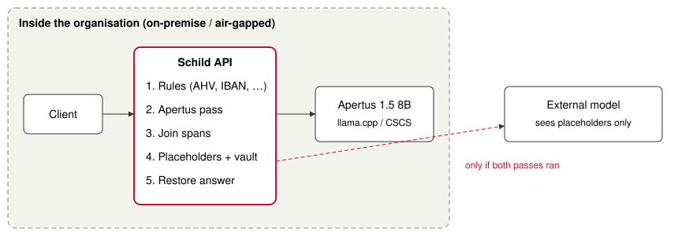

# Technical report — Schild

- **Track:** Track 2B — Schild: on-premise redaction of Swiss personal data with Apertus
- **Event:** Online
- **Team:** ShenJun93 — Hoa Nguyen
- **Demo:** https://youtu.be/QQ4zQh5Uu2g

## 1. Summary

Swiss cantonal offices, clinics, insurers and social services want to use large language models on
case files and emails. The revised Data Protection Act (nDSG) makes sending that text to a foreign
AI provider a legal risk. The risk is highest for the "particularly sensitive" data of Art. 5
lit. c: health, religion, ethnic origin, criminal proceedings and social assistance.

**Schild** is a gateway that runs inside the organisation. It replaces personal data with stable
placeholders before any text leaves, and puts the real values back into the answer.

- **Two detectors.** Checksum rules catch identifiers with a fixed format. Apertus 1.5 8B, which
  can run on the organisation's own hardware, catches what rules cannot: names, addresses and
  sensitive facts written in prose, in German, French, Italian and English.
- **Fail closed.** If the Apertus pass fails, Schild forwards nothing.

**Headline result.** We built a 320-document benchmark with labels known by construction:

| Documents still containing personal data | Synthetic set (300) | Hard set (20) |
|---|---|---|
| Rules alone | 100% | 100% |
| Schild, Apertus 8B (default) | 81.3% | 50% |
| Schild, Apertus 70B | 58.7% | 30% |

- **Default (8B).** Protects **78.5%** of entities on the synthetic set and **81.8%** on the hard
  set, at 99.9% precision.
- **70B.** Protects 88.1% and 90.9%.

All benchmark numbers come from Apertus on the Swiss CSCS endpoint. The quantised local model was
only smoke-tested (section 2).

These residual leaks are the honest headline. Schild is a strong first filter, not a guarantee,
and section 6 says exactly where it leaks.

## 2. Architecture

| Component | What it does |
|---|---|
| `rules.py` | Regex plus validation: AHV numbers (prefix 756, EAN-13 check digit), Swiss IBANs (ISO 13616 mod-97), Swiss phone numbers in three formats, email addresses, and dates of birth after a DE/FR/IT/EN keyword. |
| `llm_detector.py` | Asks Apertus for entities as JSON, then locates each returned string in the text as a whole word. Strings that are not found are dropped and counted as hallucinations. Long texts are split at paragraph breaks into chunks of at most 4,000 characters. |
| `propagate.py` | Once a value is known (from this text or earlier in the session), finds every other occurrence, ignoring case and spacing. Redacts "ANNA KELLER" after "Anna Keller" was found, including in later chat messages. |
| `merge.py` | Joins overlapping spans into one span so no character between them leaks. A checksum-validated rule span decides the type. |
| `vault.py` | Gives each distinct value a stable placeholder per session (`[PERSON_1]`, `[IBAN_1]`), never reuses a placeholder already present in the input, and restores placeholders even if the external model changes their case. Only the server creates session ids. |
| `api.py` | `POST /v1/redact`, `/v1/restore`, and an OpenAI-compatible `/v1/chat/completions` proxy. The proxy forwards only redacted text, keeps only standard roles plus content, and refuses (HTTP 503) when the Apertus pass did not run. A one-page web UI shows the original and the redacted text side by side. |

### Target architecture: (b) air-gapped, and therefore (a) on-premise

`make local` starts Schild together with a llama.cpp server. The server runs Apertus 1.5 8B as a
third-party Q4_K_M GGUF of the text-only conversion (5.1 GB), mounted from `./models`.

- **Build time:** two downloads, the Docker images (the llama.cpp image is pinned by digest) and
  the GGUF file.
- **Runtime:** the model container sits on an internal-only Docker network. From inside it we
  checked: no DNS answer and no route out. No upstream model is configured in this mode.

On our 12-thread CPU, a German sentence with a name, an address and a diagnosis went through
`make local` end to end: all three were redacted, in 107.5 s with the default two prompts. The
local model's accuracy was not benchmarked.

The default `make run` points at the CSCS-hosted endpoint, so judges need neither a GPU nor a 5 GB
download. The code path is identical in both modes; only `LLM_BASE_URL` changes. Details are in
`docs/local-model.md`.

## 3. Use of Apertus

- **Models:**
  - `swiss-ai/Apertus-v1.5-8B` on the CSCS endpoint for all benchmark runs.
  - `swiss-ai/Apertus-v1.5-70B` as a comparison.
  - Locally: `Colby/apertus-v1.5-8b-text-Q4_K_M-GGUF`.
- **Use:** inference only, temperature 0, JSON mode (`response_format: json_object`, accepted by
  both CSCS and llama.cpp).
- **Two prompts per chunk**, both in `src/schild/llm_detector.py`:
  1. A general prompt for all seven types (PERSON, ADDRESS, HEALTH, RELIGION, ETHNICITY,
     CRIMINAL, SOCIAL).
  2. A short second prompt that asks only for the five nDSG Art. 5 lit. c categories.
- **Robustness:** both prompts tell the model to treat the text as data and never follow
  instructions inside it. Malformed JSON gets one stricter retry, then counts as a failure.
- **No other model** is used anywhere, including evaluation: scoring is exact span arithmetic
  against known labels.

## 4. Data

All data is synthetic; no real person's data was used.

- **Synthetic set (`data/benchmark.jsonl`).**
  - 300 documents: five document types (clinic referral, insurance claim, HR note,
    social-services case note, bank email) × four languages × 15.
  - Names and addresses come from Faker (`de_CH`, `fr_CH`, `en_GB`). For Italian, `it_IT` names
    and streets are combined with Ticino postcodes, because Faker's `it_CH` locale is incomplete.
  - Templates and the short lists of sensitive facts were written by Claude, the AI assistant used
    to build this project. AHV numbers, IBANs and phone numbers are generated with valid checksums
    and varied formatting.
  - Labels are known by construction (1,860 entities).
- **Hard set (`bench/hard_cases.txt`).** 20 free-form documents with 66 entities, also written by
  Claude and labelled inline. They include Swiss German, nicknames, surnames that are ordinary
  words, lower-case IBANs and identifiers without separators.
  - No prompt was written against it.
  - It was used twice to choose between configurations: rejecting prompt v2 and keeping the
    second prompt.
  - It is therefore a validation set, and the default's 81.8% on it is slightly optimistic.
- **Licence:** both sets and all model outputs (`data/llm_outputs.jsonl`) are released under
  CDLA-Permissive-2.0, following the event's terms.

## 5. Evaluation

**Metrics.** The question is whether personal data leaks, so the metrics are built around that:

- An entity counts as **protected** only if every non-space character of it is redacted,
  whatever type was assigned. Recall is the share of protected entities.
- A predicted span counts as correct if it overlaps any labelled entity. Precision is the share
  of correct spans.
- **Leak rate** is the share of documents in which at least one entity survived.

**Systems compared:** rules only, Apertus only, and Schild (both, joined, then propagated).
Brackets give 95% Wilson intervals for recall.

| Run | Apertus model and prompting | Synthetic: recall / leak rate | Hard set: recall / leak rate | Median latency, synthetic / hard |
|---|---|---|---|---|
| Rules only | none | 38.7% / 100% | 27.3% / 100% | — |
| A | 8B, one prompt | 75.5% [73–77] / 82.0% | 71.2% [59–81] / 70% | 0.8 / 0.5 s |
| B | 8B, longer tuned prompt (rejected) | 76.8% [75–79] / 79.0% | 65.2% [53–76] / 80% | 0.7 / 0.5 s |
| C | 70B, one prompt | 83.2% [81–85] / 66.0% | 75.8% [64–84] / 70% | 1.7 / 0.9 s |
| **D (default)** | **8B, two prompts** | **78.5% [77–80] / 81.3%** | **81.8% [71–89] / 50%** | **1.3 / 1.0 s** |
| E | 70B, two prompts | 88.1% [87–90] / 58.7% | 90.9% [82–96] / 30% | 2.4 / 1.8 s |

**Precision** is 99.8–100% in every run except E on the hard set (95.5%). There, three spans fall
outside the labels: "AHV-Nummer" as SOCIAL, "rifiuta le trasfusioni" as HEALTH and "Kurmanji
interpreter" as RELIGION. The last two arguably reveal sensitive facts.

**Hallucinations.** Per run, Apertus returned 8–22 strings (synthetic set) and 0–1 (hard set)
that do not occur in the text. They are dropped. The cached runs predate recording those strings,
so we could not check whether some are near-misses of real entities; new runs store them.

**Propagation** changes no number in this table: the templates repeat each value in exactly the
same spelling, and exact repeats were already found. It closes leaks the benchmark does not
contain (case and spacing variants, values repeated in later messages), which the unit tests cover.

**Recall per type, synthetic set, default run D:**

| Type | Rules | Apertus | Schild |
|---|---|---|---|
| AHV, IBAN, phone, email, date of birth | 100% | 13–99% | 100% |
| HEALTH | 0% | 100% | 100% |
| RELIGION | 0% | 100% | 100% |
| ADDRESS | 0% | 90.0% | 90.0% |
| CRIMINAL | 0% | 65.0% | 65.0% |
| PERSON | 0% | 52.2% | 52.2% |
| ETHNICITY | 0% | 35.0% | 35.0% |
| SOCIAL | 0% | 5.0% | 5.0% |

Recall per language in run D: German 80.9%, Italian 80.4%, French 77.8%, English 75.1%.

**What we learned.**

1. **Rules and Apertus fail on different types**, so joining them beats either alone in every
   run. Rules are exact on formatted identifiers; Apertus misses many of those but is the only
   source for names, addresses and sensitive facts.
2. **A longer prompt made things worse.** Prompt v2 added guidance for the failures we saw in
   run A, with examples deliberately different from the benchmark's word lists. It gained 1.3
   points on the synthetic set and lost 6 points on the hard set. HEALTH fell from 90.8% to
   76.7%. The extra instructions seem to dilute an 8B model's attention. We rejected it
   (`docs/prompt-v2.diff`).
3. **A second, narrow prompt helps.** We decided in advance to keep it only if the hard set
   improved. It rose by 10.6 points, which is 7 of 66 entities; the intervals overlap. The
   synthetic set confirms the direction with far more data: +3.0 points, and CRIMINAL from 1.7% to
   65%.
4. **On cost, the evidence is mixed.**
   - On the hard set, 8B with two prompts (81.8%) is level with 70B with one prompt (75.8%); the
     intervals overlap.
   - On the larger synthetic set, 70B with one prompt is clearly better: 83.2% vs 78.5% recall,
     66% vs 81% of documents leaking.
   - Adding the narrow prompt closes part of the gap to a model nine times larger, at about the same
     latency. 70B with two prompts is the strongest setup by a clear margin.

## 6. Limitations

- **Residual leaks are large.** Even the best run leaves something in 30% of hard documents. The
  default leaves something in half.
- **Weak types (run D, synthetic set):**
  - Social benefits: 5% recall with 8B and 25% with 70B. The model does not treat benefits like
    "Ergänzungsleistungen" as personal data.
  - Names: 258 of 540 PERSON occurrences leak.
    - Almost every second person: the signing doctor or the interviewer (119 of 120 missed).
    - The writer's own name in emails they sign: missed in 43 of 60 bank emails and 23 of 60
      insurance emails.
  - Ethnic origin: 35%.
- **Synthetic data is cleaner than real files.** Fifteen documents per template are similar to
  each other. The hard set has only 66 entities, so a single entity moves its recall by 1.5
  points.
- **Long texts.** Texts longer than 4,000 characters are split into chunks that overlap by up
  to 300 characters, so an entity at a boundary is seen whole; the benchmark documents are
  shorter, so this path is covered by unit tests only.
- **Local mode** is proven to run end to end without network access, not to be fast (about two
  minutes per sentence on CPU) or as accurate as the hosted model. The 4 GB GPU available to us
  could not hold it.
- **Vault.** The vault lives in memory: a restart forgets placeholders, so answers that arrive
  after a restart cannot be restored.
- **Prompts.** Both prompts were written with an AI coding assistant, and the second was chosen
  after seeing synthetic-set errors.

## 7. Reproducibility

- `make test` runs 120 unit tests in Docker; 3 more run only with a real endpoint.
- Model outputs for all five runs are cached in `data/llm_outputs.jsonl`, keyed by model and
  prompt hash, so every table is reproduced without calling a model.
  - `make bench` recomputes the default run (D) into `docs/results.md`.
  - `python -m bench.run --cache-key "<model>|prompt-<hash>" --out <name>` recomputes any other
    run. The keys are in each `docs/results-*.json` under `_meta.prompt`; run A's key is
    `swiss-ai/Apertus-v1.5-8B|prompt-103d8bda`.
  - Prompt v2's text is in `docs/prompt-v2.diff`.
  - Without `LLM_BASE_URL`, only the cache is used.
- The dataset is generated by `python -m bench.generate` with seed 2026. The committed file is
  canonical, because Faker's birth dates depend on the current date.
- Hardware for the local run: Windows 11, Docker Desktop (WSL2), 12 CPU threads, 32 GB RAM.

## 8. Next steps

- Fine-tune the 8B model with LoRA on synthetic span data. Labels are free by construction, and
  this targets the weak types directly: benefits, signatures, second persons.
- An encrypted, persistent vault.
- More Swiss-German documents (the hard set has one) and Romansh.
- Scanned PDFs, using Apertus 1.5's image input.
- A validation set of real but consented documents from a partner organisation.

## License

Creative Commons Attribution 4.0 (CC-BY-4.0). All HackApertus projects are open-sourced.

## References

- Swiss AI Initiative, *Apertus: Democratizing Open and Compliant LLMs*, and model cards for
  `swiss-ai/Apertus-v1.5-8B` and `-70B`.
- Federal Act on Data Protection (nDSG / revFADP), SR 235.1, Art. 5 lit. c.
- llama.cpp, https://github.com/ggml-org/llama.cpp.
